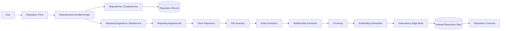
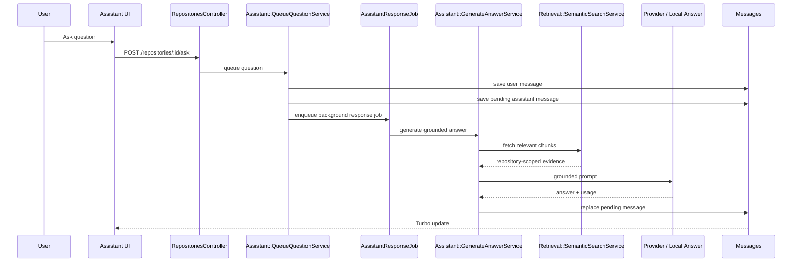
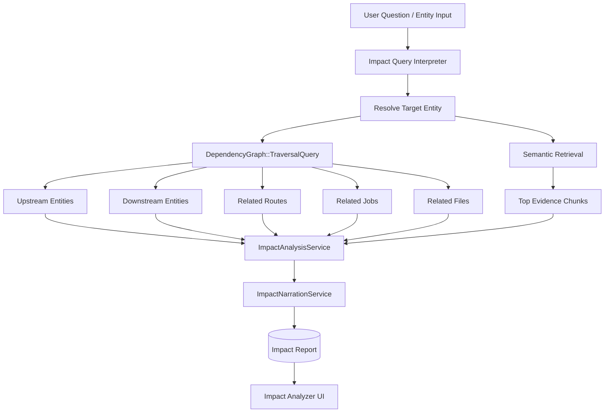

# Feature-Wise Technical Request / Response Flow

This document explains how each major feature works.

- low-paragraph
- request → processing → response
- graphical where useful
- focused on current MVP behavior

---

## 1. Repository Creation + Initial Ingestion

### Purpose

User adds a repository and the system builds its indexed knowledge base.

### Request / Response Flow



### Input

- repository name
- GitHub URL
- default/tracked branch

### Output

- repository record created
- ingestion queued
- repository becomes searchable and analyzable after success

---

## 2. Manual Re-Sync

### Purpose

Refresh repository intelligence from the tracked branch.

### Flow

```text
User clicks Re-sync
→ RepositoriesController#resync
→ RepositoryIngestions::StartService(force: true)
→ RepositoryIngestionJob
→ rebuild indexed snapshot
→ update repository status + ingestion history
```

### Output

- new ingestion run
- refreshed chunks, entities, edges, embeddings

---

## 3. Repository Assistant

### Purpose

Ask repository questions and get grounded answers.

### Request / Response Flow



### Input

- natural-language repository question

### Output

- assistant answer
- citations / evidence
- conversation history
- provider usage logs

---

## 4. Semantic Search

### Purpose

Search indexed repository chunks by meaning, not exact keyword only.

### Flow

```text
User enters search query
→ RepositoriesController#search
→ Retrieval::SemanticSearchService
→ embed query with configured embedding provider
→ compare against stored chunk vectors
→ rank best-matching chunks
→ render search results
```

### Output

- top matching files/chunks
- line ranges
- chunk type

---

## 5. Impact Analyzer

### Purpose

Estimate what may be affected if a code entity changes.

### Request / Response Flow



### Input

- direct entity name  
  `RepositoryIngestion`

- natural-language impact question  
  `What breaks if RepositoryIngestion changes?`

### Output

- resolved entity
- risk level
- upstream dependencies
- downstream dependents
- routes
- jobs
- impacted files
- evidence-backed summary
- narrated review guidance
- checklist
- saved impact report

### Good Inputs

- `What breaks if ApplicationController changes?`
- `Which files depend on RepositoryIngestion?`
- `What APIs use SettingsController?`
- `What jobs depend on AssistantResponseJob?`

### Weak Inputs

- `Impact of rework on design?`
- `How risky is refactoring this app?`

Reason:
- current analyzer is still **entity-centric**
- broad conceptual prompts need a concrete code target

---

## 6. Provider Logs

### Purpose

Track AI/embedding calls, usage, latency, and estimated cost.

### Flow

```text
Feature calls provider
→ Ai::ProviderCallLogRecorder
→ save provider, model, operation, tokens, latency, cost
→ Provider Logs page shows history
```

### Captured For

- assistant
- embeddings
- impact narration

### Output

- execution history
- debugging trail
- usage/cost visibility

---

## 7. Centralized AI Settings

### Purpose

User controls assistant + embedding providers from one place.

### Flow

```text
User opens AI Settings
→ selects provider/model/base URL
→ saves settings
→ repository features inherit current user-level config
→ assistant/search/impact use those settings at runtime
```

### Controls

- assistant provider
- assistant model
- embedding provider
- embedding model
- Ollama base URL

---

## 8. Saved Impact Report History

### Purpose

Keep reusable analysis snapshots.

### Flow

```text
Impact analysis succeeds
→ ImpactReport saved
→ History popup lists reports
→ user can:
   - open report
   - analyze again
   - jump to assistant
```

### Output

- reusable impact snapshots
- historical comparison base

---

## 9. System Boundaries

### Repository Scope

- every assistant/search/impact request runs for **one repository only**
- no cross-repository mixing in MVP

### Snapshot Scope

- answers use the latest successful ingested snapshot
- not the live remote repo at query time

### Current Limitation

- impact depth depends on extracted entities and dependency edges
- strongest on repos where extraction is richer

---

## 10. Quick Feature Map

| Feature | Input | Core Service Path | Output |
|---|---|---|---|
| Repository Create | GitHub repo info | `Repositories::CreateService` | repository record |
| Ingestion | repository + branch | `RepositoryIngestionJob` | indexed snapshot |
| Assistant | natural-language question | `Assistant::GenerateAnswerService` | grounded answer |
| Search | search query | `Retrieval::SemanticSearchService` | matching chunks |
| Impact Analyzer | entity / impact question | `TraversalQuery` + `ImpactAnalysisService` | risk + blast radius |
| AI Logs | provider call metadata | `Ai::ProviderCallLogRecorder` | usage/cost history |

---

## 11. Best Demo Order

If you want to explain the product quickly:

1. Add / ingest repository
2. Show repository overview
3. Ask assistant a repository question
4. Run semantic search
5. Run impact analysis
6. Open provider logs
7. Open saved impact history

